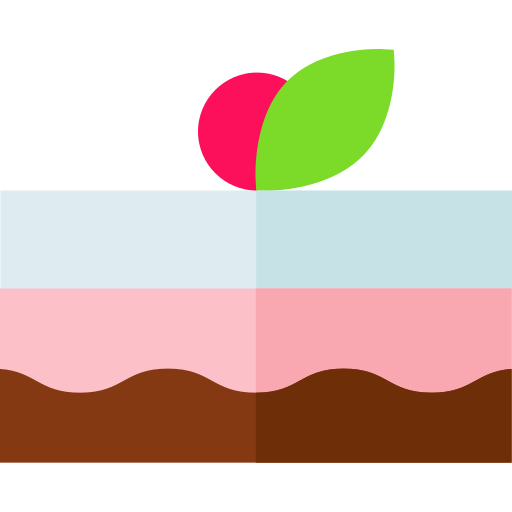

# Dessert  Finder

Welcome to Dessert Finder. 

This is a web application that allows users to store and access dessert recipes. There is a robust non-relational database schema hosted on MongoDB. A backend code that groups and summarises the recipes on the site, based on their attributes and a frontend page to show this summary, and make the categories clickable to drill down into a filtered view based on that category. Using Python and Flask the backend code will retrieve a list of recipes, filtered based on various criteria (e.g. allergens, cuisine, etc…) and order them based on some reasonable aspect (e.g. number of views or upvotes). The frontend page will display these and show some summary statistics for the data.
There is a detailed view for each recipe, that would just show all attributes for that recipe, and the full preparation instructions. Users can edit and delete their own recipe records as well as their user details.
There is a secure user registration and authentication to the site. This allows for a more personalised experience and ensures data is secure.

View the deployed site [here](https://dessert-search-ms3ag.herokuapp.com)

| Contents  |
|-----------|
|[UX](#UX) |
|[Features](#Features)|
|[Testing](#Testing)|
|[Deployment](#Deployment)|
|[Credits](#Credits)|

### UX
___

#### Strategy

The site should...

* be visually appealing - using colours, styles and fonts which reflects the style of the brand
* provide quick access to the database of recipes
* allow the user to search for recipes by ingredient and allergen information
* allow the user to filter their search results
* allow users to add/delete and change recipes in the database
* allow users to add/change their details in the database
* allow users to like and save recipes

For the user the site should...

* be intuitive and easy to use
* be personalised and welcoming
* provide quick access to recipes with a very simple search and filter function
* look appealing and in keeping with the brand
* ensure their data is secure
* allow them to manage their own recipes and user data
* allow them to keep their favourite(liked) recipes


##### User Stories

* As an inexperienced cook... 
    1. As a user, I want quick access to a variety of desserts based on ingredients I know I like
    2. As a user, I want to be able to find recipes that are quick to make
    3. As a user, I want to be able to save the recipes that I have enjoyed
* As an experienced cook...
    1. As a user, I want quick access to a variety of desserts based on ingredients I like
    2. As a user, I want to see information about the recipe (such as preparation time, how many it serves and allergen information) at a glance
    3. As a user, I want to be able to share my knowledge and experience by easily adding my own recipes to the site
    4. As a user, I want to be able to manage my recipes, editing them or deleting them as necessary
    5. As a user, I want to be able to save my favourite recipes and access them quickly
* As a user with food-intolerance or allergies...
    1. As a user, I want to search a database of recipes that will be suitable to my needs
    2. As a user, I want to clearly see suitable recipes at a glance

#### Scope

In order to create a good UX Dessert Search...

* be developed with a mobile-first approach in order to suit the target user group (cooks using phones or tablets in the kitchen)
* be responsive in order to display across a range of devices
* be intuitive and provide feedback to the user on their actions
* should feature a cohesive design which promotes the Dessert Search brand
* will have a simple search interface with filters
* will be functional to any user, whether logged in or not, but provide extra functionality and personalisation to registered users

Please find my initial wireframe and database schema, created using Balsamiq, [here](development/wireframes/DessertSearch.pdf)



### Features
___

#### Existing Features

> Navigation Bar/ Dropdown Menu

I used Bootstrap 4 to create a minimalist navigation bar that would toggle a dropdown menu on mobile/tablet devices. A user should not have to use the browser's back-button as the navigation bar is fixed. 

> Hero Video

I set the body element a fixed background video on larger devices as it creates a modern/ professional touch and adds credibility to the site. As it wouldn't render correctly on mobile devices I opted for a background image with an overlay which would help with text-contrast and readability.

> Main Search Box

For good UX design I decided to have a minimal search interface on the index page. I used Python to programme how this would search the database and created a very complex code of if statements to try and predict how users would use this. Pressing search without entering text or checking a checkbox will show the whole database, I felt this was required to meet the needs of users who were unsure what they were looking for. I have also used Jinja templating to add a button to return to the search page if 0 recipes are found.

> Filter Checkboxes

Again, for good UX design in keeping with a minimal search interface on the index page I used checkboxes to filter the database results before they displayed. This was by far one of the most difficult functions of my design and took a long time to code, debug and eventually implement. I have written a function using Python to ensure that everything works as intended for the user.

> Filter Accordion on Search Results

I felt that some users may not be sure what they are looking for immediately, having extra filters on the search results page would prevent users from having to navigate back to the search box. I used jQuery to hide recipe cards that did not match the checked checkboxes and created a button that would reset the filters. It was important that for each additional checkbox that was checked the recipes would be filtered further and not reset.

> Bootstrap 4 grid layout and cards

I used Bootstrap styling for my search results and user home pages to ensure that the pages would be as responsive as possible. I also used cards for a standard layout of recipes, this is visually effective because it porvides the necessary 'at-a-glance' details for the user. I also used "object-fit:cover" in CSS to try to ensure that each recipe image would display nicely within the card.

> User Register and Login using WTForms and Werkzeug security

I imported Flask WTForms and Werzkeug Security to create a login process that was secure and created user profiles in my database. It ensured there were no duplicate usernames and that recipe author and recipe likes could be found and personalised for each registered user.

> Fetch API

I used Fetch to 'GET' user data from my Python app.py, this ensured that the user would only see menu links that were appropriate to them i.e. non-registered users would see login and sign up links but current authenticated users would be able to access their user home.

> Jinja Templating

I used Jinja templating to create a base.html page with navbar and footer that would ensure a standardised aesthetic across the site. I also used the templating to print data from the database (i.e. within 'edit recipe' the previous input is displayed in the form) and create if and for loops that continued to personalise the user's experience.

#### Features for the Future

It would be appropriate to obtain mailing data from the user in order to have a mailing list with new and featured recipes.

It would be highly likely that pagination would be required as the database grows.

It would be suitable to find a way for users to upload their own photographs of the recipes rather than entering a URL.

It could be possible to allow users to comment on recipes, creating more of a community ethos.

It could be possible to integrate social media feeds (i.e. Instagram) to provide more user-generated content and community.

### Technologies Used

##### Languages

* **HTML** - used for creating content and basic layout and validated with W3C
* **CSS** - used for customised styling and layout and validated with W3C
* **JavaScript** - used to provide interactivity and logic to the site
* [Python](https://www.python.org/) - used to programme the site and interact between the database and the frontend
* [SASS](https://sass-lang.com/) - used as a preprocessor in creating style files with variables, media queries and mixins

##### Frameworks

* [Flask](http://flask.pocoo.org/) - A Python micro framework that includes [Jinja Templating](http://jinja.pocoo.org/) and [Werzkeug](https://werkzeug.palletsprojects.com/en/0.15.x/) debugger. Werzkeug also provided password hashing which would ensure users' passwords are encrypted before being stored in the database.
* [Bootstrap](https://getbootstrap.com/) - used for responsive layout, basic styling, dropdown Navbar (JavaScript for these features was used - linked to Bootstrap and, through BS, popper.js in <script> tags)

##### Tools

* [PyMongo](https://api.mongodb.com/python/current/) - An API which provides tools for working with MongoDB in Python
* [MongoDB](https://www.mongodb.com/) - non-relational document style database used to store the recipes and users for Dessert Search
* [WTForms](https://wtforms.readthedocs.io/en/stable/) - An API which provides form classes for ease of managing form data in Python
* [CSS Minifier](https://cssminifier.com/) - used to minify my CSS data for deployment
* [Favicon Generator](https://www.favicon.cc/?) - I used this to generate a Favicon
* [W3C Validator](https://validator.w3.org/) - HTML Validator 
* [W3C CSS Validator](https://jigsaw.w3.org/css-validator/) - CSS Validator
* [PyCodeStyle](https://pypi.org/project/pycodestyle/) - Python Validator
* [JSLint](https://www.jslint.com/) - JS Validator
* [Cloud9 IDE](https://ide.c9.io/) - this was the IDE where I developed and tested my application
* **Git** - I pushed my files using **Git**, storing them in a repository on **GitHub**
* [Heroku](https://heroku.com/) - I deployed my finished site through Heroku
* [Chrome Developer Tools](https://developers.google.com/web/tools/chrome-devtools/) - used to test and check my work throughout the development process

##### Libraries

* [jQuery](https://jquery.com/) - JavaScript library used to connect with APIs and custom-code for the site which allows for DOM manipulation
* [Google Fonts](https://fonts.google.com/) - used for customised fonts
* [Font Awesome](https://fontawesome.com/) - used for links and icons to make the site more appealing


### Testing
___

#### Manual and Automated Testing

Manual testing was done for all CRUD operations from the database as well as for all links, buttons and forms in the site. I used Werkzeug Debugger throughout the development process to immediately flag errors when running my app.py file.

I created a [test.py](development/testing/testdb.py) file that tested the connection to my database, ensuring data was inserted in a suitable manner and was returned to the console when requested.

Throughout the process I continually manually tested the frontend, by saving my work in the IDE and running it in Google Chrome. I used Chrome Developer Tools to ensure that my site was responsive and functioned in all screen sizes and that my styling was applied appropriately throughout. 

I set ```console.logs``` and ```debugger``` statements throughout my js files in order to debug through the console.

I used jQuery to manipulate the DOM in Chrome Developer Tools in order to test my code visually before writing it within the script.

I had several users log in and out of the website searching, adding, editing and deleting (CRUD) the recipes. This was to ensure that only registered users were able to delete/edit their own recipes. It also verified that the correct author showed up for each recipe. 

#### Responsiveness

I tested my project throughout development using Chrome Developer Tools to check the site was responsive. I continually made adjustments to my media-queries in CSS to ensure it looked good at all screen-widths, however I realised my laptop had a different screen size to the standard. I began to investigate a range of screen sizes and realised the best option was just to make it as responsive as I possibly could!

#### Bugs

There were several issues with my Python code, however, using the Werkzeug Debugger allowed for an immediate fix. I used the documentation for Flask, PyMongo and MongoDB to help solve any problems. I found it very difficult to get a search function that would search text and use checkboxes. I eventually had code that would work in every instance although I am aware that it could be neater.

There was a 500 error displaying in the console when Fetch was trying to retrieve login details from an anonymous user. I've run out of time on my project to fix this issue but I'd look into an if statement in the fetch function or in python to catch this.

There was a 400 error in the console for the favicon. I created a favicon.

There is a known issue with the 'back' button on the view recipe pages, as they return to the main search page in this instance they require form resubmission. I have looked into this in various developer support resources but have yet to find a fix. Essentially I want to go back and refresh the page automatically for the user, just like using the browser back button. When a user liked a recipe and then clicked the back button it took them back to view recipe with an active like recipe button again. I fixed this by searching the current url for 'like_recipe', if it was located the back button would go back by 2 pages.
*I have decided to send the user back to Search Results temporarily, as I feel the user's experience would be blighted by an ERR_CACHE_MISS page and the alternative of having to reset the filters or pressing the browser's back button would provide a less negative experience for the user. I then had to create a back to user home button*

There is an issue with the recipe description and method not rendering correctly, they render as input in the terminal when printed but do not when rendered in the HTML template, I have attempted to fix this but there are sometimes two full stops at the end of the text. I am continuing to look for a fix.

There is also an issue with duplicate ingredients not showing up, this is because I currently have each ingredient set as a key in the database and therefore can't have duplicates. I will continue to look into this.

There have been several issues throughout development with my JS code breaking, I worked hard using console.logs and debuggers to pinpoint errors and fix them. There shouldn't be any errors displaying in the console except for the above 500 error, intermittently.

There was a security issue related to the app.py view where the database string was returned in the URL. This could enable people to find and access the dtabase. I quickly fixed the URL parameter to be the user._id rather than users._id.

### Deployment
___

#### How to Install Dessert Finder

1. From your terminal enter `git clone https://github.com/paperclippete/Milestone3.git` to clone the project and download to your IDE

2. Set up your Virtual Environment Variables 
    * this can be done by creating folder named .venv to hold your variables and importing them into your app.py
    * this can be done in your IDE bash terminal - e.g. cd .. to your root directory and type `nano.bashrc` and type in your important environment variables
    
    * Your environment variables should not be committed to git*


3. You should now install the requirements by typing `$ sudo pip3 -r install requirements.txt`

4. You will also have to create your own database to get full functionality from the project. [MongoDB](https://www.mongodb.com/) is free and easy to use. 

> Within my Database I had two collections, recipes and users

``` 
    recipes
    {
    _id: ObjectId("5cfd48d8b93f0ccb1dcbe754")
    ingredients: Object
        key: "value"
    dairy_free: bool
    gluten_free: bool
    main_ingredient: "string"
    recipe_description: "string"
    title: "string"
    image: "string"
    method: "string"
    author: "string"
    vegan: bool
    prep_time: "string"
    serves: "string"
    like_count: Int
    likes: Array
        0: ObjectId("5cfd48d8b93f0ccb1dcbe754")
    }
    
    users
    { 
    id: ObjectId("5cfd4210b93f0ccb1dcbe74f")
    last_name: "string"
    first_name: "string"
    password: "string" (hashed)
    username: "string"
    }
```    

#### How to Deploy your Site

I committed my code to GitHub at regular intervals. I am now using git more often, making sure to give detailed commit messages as I know it provides version control.

1. In order to deploy the site to Heroku, you must create a Procfile and requirements.txt. *These will tell Heroku how to run your app.*
    * To create a Procfile - `echo web: python (your filename).py > Procfile ` 
    * To create a requirements.txt - `sudo pip3 freeze --local > requirements.txt ` 

2. Next, log into Heroku and set up the remote.
    ``` 
    
 
    heroku login  
    
    git remote add heroku(url) 


    ``` 

3. You then need to setup your Heroku Enivronment Variables and you can do this in two ways, either through the terminal or by navigating to [Heroku](http://heroku.com).

4. On navigating to the Heroku website, log in and select your app from the dashoboard.

5. Choose settings and click on 'Reveal Config Vars' and insert the environment variables that are essential for your project to run. For example, 

    > IP - 0.0.0.0 
    PORT - 8080 
    MONGO_URI - mongodb+srv://root*your password*@myfirstcluster-ug8tc.mongodb.net/*your database*?retryWrites=true 
    DB_NAME - *your database name*
    SECRET KEY - *create a secret key*
    
    * You should never reveal any of these environment variables to ensure you maintain the security of your database *

6. You should then send your committed code to Heroku using `git push heroku master` and view your deployed site on the URL provided within your Heroku dashboard.

#### Differences between Development and Deployed version

The difference between the deployed version and the development version is that I'm using a minified CSS file whereas I used SASS to compile my styling during development. I also set the debug to false for deployment.

### Credits
___

#### Content
The recipes and recipe images were inserted for testing purposes were taken from the [BBC website](https://www.bbc.co.uk/food).

The background image was from [Pexels](https://www.pexels.com/search/website%20background%20food/), the video was from [Videvo](https://www.videvo.net/). The cake images and icons were from [FlatIcon](https://www.flaticon.com/).

**This site has been created for educational purposes only**

#### Media
The images and text were sourced from the sites listed above. All images have been used for educational purposes only.

#### Acknowledgements

I used Ian Lunn's [Hover](https://ianlunn.github.io/Hover/) for my navbar link hover effects. I have clearly marked the borrowed code in my CSS.

I used [W3Schools](https://www.w3schools.com/) code as a basis for my custom checkboxes.

Throughout this project I have sought support and guidance from [Stack-Overflow](https://stackoverflow.com/), Code-Institue [Slack](https://slack.com/intl/en-gb/) Community, [W3Schools](https://www.w3schools.com/), [CSS Tricks](https://css-tricks.com/), [Pretty Printed](https://prettyprinted.com/) YouTube videos.

